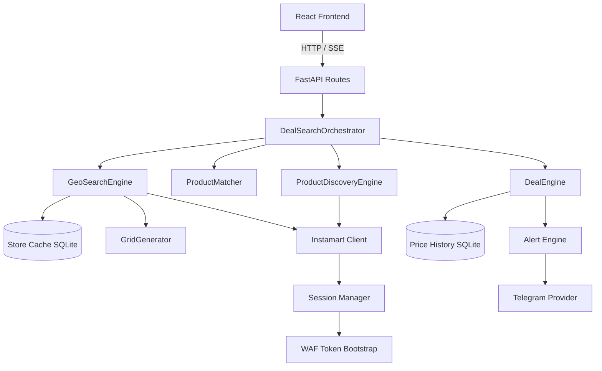

# Architecture

This document defines the architecture for Worth-It.

## 1. System Overview

Worth-It is a three-tiered Python backend (FastAPI) and React frontend application designed to find hyper-local grocery deals. It accepts a search keyword, evaluates local availability, and progressively expands geographically to find hidden deals at nearby dark stores.

## 2. Architectural Layers

The architecture is strictly divided into three layers to ensure separation of concerns and allow for future multi-platform expansion.

### 2.1 Infrastructure Layer
- **Geo Search (`geo/`)**: Hex grid generation, Haversine distance, progressive radius math.
- **Store Cache (`geo/store_cache.py`)**: SQLite-backed cache of discovered stores to avoid redundant coordinate probing.
- **Persistence (`persistence/`)**: SQLite database for Price History, Observations, and Alert rules.
- **Notifications (`notifications/`)**: Abstract providers (Telegram initially).
- **Transport / API (`api/`)**: FastAPI routes, SSE streaming, rate limiting.

### 2.2 Platform Layer (`platforms/instamart/`)
Handles all Instamart-specific communication. No Instamart JSON should leak outside this layer.
- **Session Manager**: Manages AWS WAF tokens and headless browser bootstrap.
- **Location Client**: Resolves coordinates to Instamart `storeId`.
- **Search Client**: Handles keyword search, pagination, and exact product fetching.
- **Parsers**: Translates raw API responses into normalized Domain models.

### 2.3 Domain / Intelligence Layer (`domain/`)
The core business logic.
- **Product Discovery (`ProductDiscoveryEngine`)**: Takes a keyword and returns canonical product candidates.
- **Product Matcher (`ProductMatcher`)**: Deterministically filters candidates (include/exclude rules, brand matching).
- **Deal Engine (`DealEngine`)**: Calculates true discount (MRP vs Price), compares against thresholds (e.g., minimum 50% off), and checks historical lows.
- **Deal Ranker (`DealRanker`)**: Sorts results by best discount, lowest price, or closest distance.
- **Search Orchestrator (`DealSearchOrchestrator`)**: The master controller that manages the local-to-geographic search flow.

## 3. Component Diagram

## 4. WAF / Session Architecture

AWS WAF protects Instamart. We adapt the `instamart-alerts` pattern:
1. **Bootstrap**: A singleton `SessionManager` uses Playwright to navigate to Instamart, solve the JS challenge, and extract the `aws-waf-token`.
2. **HTTP Transport**: The application predominantly uses `httpx` with the extracted token for fast, concurrent requests.
3. **Re-minting**: If a request receives an HTTP 202 or 403, the HTTP layer throws a `Blocked` exception, pausing the orchestrator while the `SessionManager` mints a new token.

## 5. Local to Geographic Flow

The orchestrator uses a "progressive expansion" strategy to save API calls.
1. **Local**: Search the user's immediate delivery area. If the target product is found and meets the deal criteria, **stop and return**.
2. **Bridge**: Extract the exact Instamart Product IDs of the matched items.
3. **Expansion**: Expand the radius (e.g., 3km, 5km). Query the `StoreCache` for stores. Probe the `GeoSearchEngine` grid for unknown areas.
4. **Targeted Fetch**: For newly discovered stores, do NOT perform a keyword search. Perform an exact ID lookup for the Product IDs discovered in Step 2.

## 6. Product Matching (Deterministic)

V1 avoids LLMs for performance and reliability.
- **Input**: Query "Nutrabay protein"
- **Normalization**: Lowercase, remove special characters.
- **Filtering**: Reject products containing negative keywords (e.g., "shaker", "bar", "creatine" if not requested).
- **Categorization**: Ensure the item falls under health/supplements or groceries.

## 7. Deal Engine

The Deal Engine never trusts the platform's "X% OFF" string.
- Takes normalized `mrp` and `price`.
- Calculates: `((mrp - price) / mrp) * 100`.
- Evaluates conditions: `discount >= 50%` OR `price <= max_price`.
- Checks the `Price History SQLite` database to identify "Historical Lows" or "Price Drops".

## 8. Server-Sent Events (SSE) Architecture

The frontend requires real-time feedback. The `DealSearchOrchestrator` yields typed dictionaries, which FastAPI streams to the React UI via `EventSource`.
- `search_started`
- `location_resolved`
- `local_search_started`
- `product_discovered`
- `radius_expanded`
- `deal_found`
- `search_completed`

## 9. Failure Handling & Cancellation

- **Cancellation**: If the SSE connection drops (client disconnects), the FastAPI generator raises a disconnection error, and the Orchestrator cancels all running `asyncio.Task` instances for grid probing.
- **Timeouts**: All HTTP requests to Instamart have strict timeouts.
- **Missing Stock**: If a store does not carry the item, it is logged quietly; it does not fail the search.
